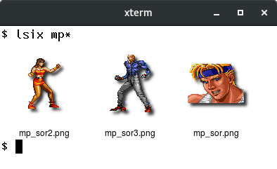

# lsix
Like "ls", but for images. Shows thumbnails in terminal using [sixel](https://en.wikipedia.org/wiki/Sixel)
graphics.


## Usage

    lsix [ FILES ... ]

## Examples

### Basic Usage

Just typing `lsix` will show images in the current working directory.
You can also specify filenames and, of course, use shell wild cards
(e.g., `lsix *jpg *png`).

Because lsix uses ImageMagick pretty much any image format will be
supported. However, some may be slow to render (like PDF), so lsix
doesn't show them unless you ask specifically. If you want to force a
listing of a certain type of image simply specify the filenames or
use a wildcard (`*.pdf` in the example below),.


### Expanding GIFs 
If you specify a GIF (or actually any file that has multiple images in
it) on the command line, all the frames will get expanded and shown in
a montage. For example, `lsix nyancat.gif` shows all the frames. Note
that GIF stores some frames as only the pixels that differ from the
previous frame.


### Terminal background color is detected

You may have noticed that PNGs and SVG files have correct alpha
channel for the terminal background. That is because lsix uses
terminal escape sequences to try to figure out your foreground and
background colors. (Foreground is used for the text fill color.)

In the first example below, after running `lsix` in a white on black
xterm, I sent an escape sequence to swap foreground and background
colors. When I ran it again, `lsix` detected it and changed the
background color to white. Of course, you can pick whatever default
colors you want (e.g., `xterm -bg blue`, in the second example below).


## Features

* Detects if your terminal can display SIXEL graphics inline using [control sequences](https://invisible-island.net/xterm/ctlseqs/ctlseqs.html#h2-Sixel-Graphics).

* Works great over ssh. Perfect for manipulating those images on the
  web server when you can't quite remember what each one was. 

* Non-bitmap graphics often work fine (.svg, .eps, .pdf, .xcf).

* Automatically detects if your terminal, like xterm, can increase the
  number of color registers to improve the image quality and does so.

* Automatically detects terminal's foreground and background colors.

* In terminals that support dtterm WindowOps, the number of tiles per
  row will adjust appropriately to the window width.

* If there are many images in a directory (>21), lsix will display them
  one row at a time so you don't need to wait for the entire montage
  to be created.

* If your filenames are too long, lsix will wrap the text before
  passing it into ImageMagick's `montage`. (Without lsix, `montage` just
  jumbles long filenames on top of one another.)

* You can easily change things like the width of each tile in the
  montage, the font family, and point size by editing simple variables
  at the top of the file. *(Tip: try `convert -list font` to see what
  fonts you have on your machine.)*

* Unicode filenames work fine, as long as your font has the glyphs.

## Installation

Just put the [`lsix`](/lsix) file in your path (e.g., /usr/local/bin) and run
it. It's just a BASH shell script.

The only prerequisite software is ImageMagick. If you don't have it
yet, your OS's package manager will make it easy to get. (E.g.,
`apt-get install imagemagick`).

MacOS users may prefer to install lsix using `brew install lsix` which
installs ImageMagick, if necessary.

## Your Terminal must support Sixel graphics

I developed this using [xterm](https://invisible-island.net/xterm/) in
vt340 emulation mode, but I believe this should work on
any Sixel compatible terminal. You may test your terminal by viewing a
single image, like so:

    convert  foo.jpg  -geometry 800x480  sixel:- 

### XTerm

Note that xterm does not have Sixel mode enabled by default, so you
need to either run it like so:

    xterm -ti vt340

Or, make vt340 the default terminal type for xterm. Add the following
to your `.Xresources` file and run `xrdb -merge .Xresources`.

    ! Allow sixel graphics. (Try: "convert -colors 16 foo.jpg sixel:-").
    xterm*decTerminalID	:	vt340
    
Further, some distributions, such as Fedora, appear to not compile `xterm`
with sixel support. In that case, try an alternate terminal, such as
`foot` or `mlterm`.

### SIXEL compatible terminals

* XTerm (tested)
* foot (tested)
* MLterm (tested)
* iTerm2 for Apple MacOS (tested)
* WSLtty for Microsoft Windows (reported)
* MinTTY for Cygwin (Microsoft Windows) (reported)
* Yaft for Linux framebuffer (tested)
* VTE (special compilation, reported)

### SIXEL incompatible terminals

* MacOS Terminal, alacritty, kitty
* All standard libvte based terminals
  * gnome-terminal
  * terminator
  * lxterm

## Configuration

Because `lsix` is currently designed to be very simple, there are no
command line flags, no configuration files, no knobs to twiddle, or
frobs to frobnosticate. However, since the script is so simple, if you
want to make a change, it's pretty easy to do just by editing the
file. Everything is nicely commented with the most common default
variables at the top.

## Contact the author

I welcome feedback. If you use lsix and like it or have suggestions
for how it can be improved, please go ahead and send your thoughts to
me [@hackerb9](https://github.com/hackerb9/lsix/issues/new) via
GitHub.


## Bugs

* XTerm's reverse video mode (`xterm -rv`) is different from
  specifying the foreground and background explicitly. There is a way
  to detect the latter, but not the former. That means the background
  color will be incorrect for folks who use XTerm's reverseVideo
  resource. (See issue #20).

* XTerm's screen width is currently limited to 1000px due to a
  misfeature which causes it to silently show nothing. This limitation
  will be removed once xterm can handle images greater than 1000x1000.
  [Last tested with XTerm(344)].

* Filenames that begin with "@" are special to ImageMagick and it'll
  freak out if you don't prepend a directory. (`lsix ./@foo.png`)
  (This is a bug in ImageMagick, not lsix).

* Specifying the empty string `""` as a filename makes ImageMagick hang.
  (This appears to be an ImageMagick bug / misfeature). 

* Long filenames are wrapped, but not intelligently. Would it
  complicate this script too much to make it prefer to wrap on whites
  space, dashes, underscores, and periods? Maybe.

* Directories specified on the command line are processed as if the
  user had cd'd to that directory. It wouldn't be hard to implement
  recursion, but is there actually a need? I'm reluctant to complicate
  such a simple script with command line flags.

* If you run `lsix foo.avi`, you're asking for trouble.


## Future Issues

* The Sixel standard doesn't appear to have a way to query the size of
  the graphics screen. Reading the VT340 documentation, it appears
  your program has to already know the resolution of the device you're
  rendering on.

  XTerm, as of version 344, has added [a control
  sequence](https://invisible-island.net/xterm/ctlseqs/ctlseqs.html#h2-Functions-using-CSI-_-ordered-by-the-final-character_s_)
  that solves the problem — `CSI ? Pi ; Pa ; Pv S` — but some
  terminals, for example `mlterm`, haven't yet implemented it.

  There is an alternate way to read the window size using the dtterm
  WindowOps extension but it is not quite the right solution as the
  geometry of the Sixel graphics screen is not necessarily the same as
  the window size. (For example, xterm limits the graphics geometry to
  1000x1000, even though the window can actually be larger.) To help
  with terminals such as mlterm, `lsix` will use the dtterm WindowOps
  as a fallback.

  If neither solution works, `lsix` will assume you are on a VT340
  (800x480) and can fit only 6 tiles per row.

* The Sixel standard also lacks a way to query the number of
  color registers available. I used the extensions from `xterm` to do
  so, but I do not know how widely implemented they are. If a terminal
  does not respond, `lsix` presumes you're on an original vt340 and
  uses only 16 color registers. (Sorry, 4-gray vt330 users! Time to
  upgrade. ;-) )


* The [Kermit project](https://kermitproject.org/) created a MS-DOS
  terminal emulator that was popular in the late 1980s/early 1990s.
  Its sixel implementation is not compatible with lsix because it
  shows the graphics on a screen separate from the text. However, I
  noticed one feature in its documentation: an escape sequence to
  request the current graphics window size and number of colors:

```
 ESC [ ? 256 n                  Request screen size report

        Report is ESC [ ? 256; Ph; Pw; Pc n     for graphics systems

        where   Ph is screen height in dots
                Pw is screen width in dots
                Pc is number of colors (0, 1 or 16, for none, b/w, ega/vga)

        Report is ESC [ ? 24; 80; 0 n  for pure text mono systems.
```

  Did any other terminal emulators ever use the sequence? Would it be
  worthwhile to add to `lsix`?

* [libsixel](https://github.com/saitoha/libsixel) is an excellent
  project for writing programs that can output optimized Sixel
  graphics commands. Because I have a lot of respect for the project,
  I feel I should explain why `lsix` does not use libsixel.

  * (a) I wanted lsix to work everywhere easily. Bash and imagemagick
    are ubiquitous, so a shell script is a natural solution.

  * (b) I wanted `lsix` to be simple enough that it could be easily
    customized and extended by other people. (Including myself.)

  * (c) ImageMagick has better support for reading different formats
    than stb_image (the library used by libsixel's `img2sixel`). (For
    example: xpm, svg, 16-bit png, and even sixel files are not
    recognized by img2sixel). Since ImageMagick can read all of those
    and write sixel output directly, it made sense to use it for both.

  * (d) While libsixel is optimized and would surely be faster than
    ImageMagick, it's overkill. For a simple directory listing, this
    is plenty fast enough.

## Resources

  * [XTerm Control Sequences](https://invisible-island.net/xterm/ctlseqs/ctlseqs.html)
  * [ImageMagick](https://imagemagick.org/)
  * [VT340 Programmer's Reference](https://vt100.net/docs/vt3xx-gp/):
    * [Chapter 14](https://vt100.net/docs/vt3xx-gp/chapter14.html). Sixel Graphics.
    * [Chapter 16](https://vt100.net/docs/vt3xx-gp/chapter16.html#S16.3) Difference between Level 1 and Level 2 Sixel implementations.
        
        _Nota bene: this reference has the sense for DECSDM (sixel
        display mode) reversed! The actual behaviour of the VT340 is
        that when DECSDM is reset (the default), sixel scrolling is enabled.
        This can be done by sending _`Esc[?80l`_, but lsix does not do
        so as it would break many current terminal emulators.
        See issue #41 for details._

  * [DEC STD 070 Video Systems Reference Manual](https://archive.org/details/bitsavers_decstandar0VideoSystemsReferenceManualDec91_74264381).
    A weighty tome which covers nearly everything in exacting detail. I referred mostly to sections 4 (escape sequences) and 9 (sixel programming).

  * [VT340 Test](https://github.com/hackerb9/vt340test), a project to document the actual behaviour of the DEC VT340 hardware.

  * [Digital ANSI-Compliant Printing Protocol: Level 2 Programming Reference Manual](http://www.vaxhaven.com/images/f/f7/EK-PPLV2-PM-B01.pdf), Chapter 5: Sixel Graphics. An excellent and reasonably clear discussion for anyone who wants to generate or parse sixel graphics.